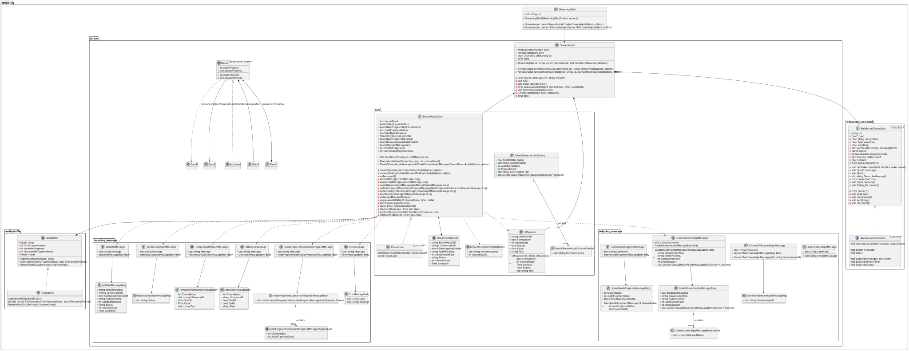

<!-- 
 -->

# Poetics C++ SDK

- [Poetics C++ SDK](#poetics-c-sdk)
- [1. Description](#1-description)
- [2. How To Run](#2-how-to-run)
- [3. SDK Build Guide](#3-sdk-build-guide)
- [4. SDK Class Diagram](#4-sdk-class-diagram)
- [5. License](#5-license)

# 1. Description

Currently supports `Windows` on `x86` and `x64` platforms.  
`Linux` and `macOS` or `arm64` is not tested.

# 2. How To Run

Check the [[`src/example_training`](./src/example_streaming/)] directory.  

# 3. SDK Build Guide

Check the [[BUILD.md](./BUILD.md)] page.

# 4. SDK Class Diagram

# 5. License

All the content in this repository is licensed under the [MIT License](LICENSE.txt).
