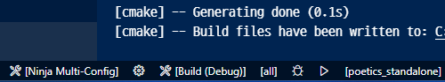
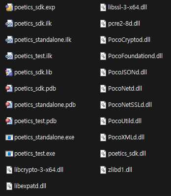
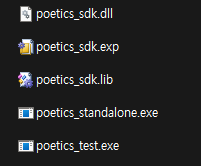

# ビルドガイド

- [ビルドガイド](#ビルドガイド)
  - [1. ビルド環境の準備](#1-ビルド環境の準備)
    - [1.1 Build Tools for Visual Studio 2022](#11-build-tools-for-visual-studio-2022)
    - [1.2 CMake \& Ninja](#12-cmake--ninja)
    - [1.3 Developer terminal for Visual StudioからVSCodeを実行する](#13-developer-terminal-for-visual-studioからvscodeを実行する)
  - [2. VSCode拡張機能の設定](#2-vscode拡張機能の設定)
- [3. ビルド、デバッグ、テスト](#3-ビルドデバッグテスト)
  - [3.1 ビルド方法](#31-ビルド方法)
  - [3.2 デバッグ方法](#32-デバッグ方法)
- [4. Integrated Development Environment (IDE)のサポート](#4-integrated-development-environment-ideのサポート)

## 1. ビルド環境の準備

### 1.1 Build Tools for Visual Studio 2022

すでにVisual Studio 2022をインストールしている場合は、この部分はスキップしても構いません。

- https://visualstudio.microsoft.com/downloads/ に移動する
- 「すべてのダウンロード」から「Tools for Visual Studio」を開き、「Build Tools for Visual Studio 2022」をダウンロードする
- ダウンロードしたファイルをインストールする

### 1.2 CMake & Ninja

- CMakeをインストールする [[Download](https://cmake.org/download/)]
  - インストール時に環境変数にCMakeを追加するオプションにチェックを入れてください。
- wingetでNinja build toolをインストールする:
  - `winget install Ninja-build.Ninja`

### 1.3 Developer terminal for Visual StudioからVSCodeを実行する

> [!IMPORTANT]
> プロジェクトを正しくビルドするには、**必ず**Developer terminal for Visual StudioからVSCodeを実行する必要があります。
> 以下のガイドにしっかりと従ってください。

- [**重要**] x86バイナリをビルドする場合,
  - `launch_devtools_x86.bat`を実行する
- [**重要**] x64バイナリをビルドする場合,
  - `launch_devtools_x64.bat`を実行する
- ターミナルから `code .`を入力

これでプロジェクトをビルドすることができます！ プロジェクトは常にこの手順で開く必要がありますのでご注意ください。

(このリポジトリをクローンして、普通のVSCodeで開くと、次のようなエラーが表示されます:

```
[cmake] CMake Error: CMake was unable to find a build program corresponding to "Ninja Multi-Config".  CMAKE_MAKE_PROGRAM is not set.  You probably need to select a different build tool.
[cmake] CMake Error: CMAKE_C_COMPILER not set, after EnableLanguage
[cmake] CMake Error: CMAKE_CXX_COMPILER not set, after EnableLanguage
```

この場合、**`builds`ディレクトリを削除**し、前述の `launch_devtools_x**.bat`を起動してVSCodeを再実行する必要があります。

## 2. VSCode拡張機能の設定

拡張機能タブに移動し、以下の拡張機能をインストールしてください:

- C/C++
- C/C++ Extension Pack
- CMake
- CMake Langugage Support
- CMake Tools

上記の拡張機能をインストールし、ステータスバーでCMakeコンフィギュレーション（例：`Ninja Multi-Config` ）を選択すると、以下の画像のようになります:



# 3. ビルド、デバッグ、テスト

現在、2つのビルド設定があります：

* Ninja Multi-Config: 一般的なビルド設定（デバッグモードで使います）
* Ninja Win64 (Static): **単一の**ライブラリファイルを生成するためのWindows用ビルド(**Releaseモードで使ってください**)。

前者の設定は、以下のように、このSDKに依存するライブラリを個別にビルドします。:



後者の設定では、以下のように、このSDKに依存するライブラリを（静的に）マージしてビルドします:



## 3.1 ビルド方法

- コマンドパレットを開く(`ctrl+shift+p`)
- `CMake: Build` を実行してすべてのターゲットをビルドする
- 現在選択されているターゲットをビルドするために `CMake: Build target` を実行する

## 3.2 デバッグ方法

- コマンドパレットを開く(`ctrl+shift+p`)
- `CMake: Debug`を実行する

# 4. Integrated Development Environment (IDE)のサポート

VSCode以外にも、Visual Studioのような主要なC++ IDEはすでにCMakeをサポートしています。

Visual Studioで `cpp`フォルダを開くことで開発を進めることができます。
